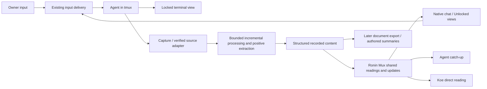

# Ronin Mux and Rireki: reliable sessions and usable recorded work

Discussion plan · 2026-09-09 · Team tmux · Reach: plan

Ronin should let the owner direct work once, then read, hear, revisit, and reuse what the agents produce. tmux supplies the persistent working environment. The recording supplies a durable account. Readable scrolls, documents, catch-up, and Ronin-Koe make that account useful. The owner's clarified priority is Ronin-Koe; Wispr import is secondary. Success means that the value of a model's work survives the terminal window without making the working environment sluggish.

This is a proposal for discussion, not an implementation commitment. Repository code, earlier investigations, and selected upstream documentation were read; no live performance measurements were taken and no recorder was enabled. Historical measurements below describe their dated experiments, not this machine's current performance.

**Two parallel tracks**

The owner has separated the general tmux problem into two equally explicit tracks. They share boundaries and integration tests, but have different issues, solutions, and acceptance criteria. Neither is a subtask of the other.

| Track | Central question | Scope | Success |
|---|---|---|---|
| A — tmux hosting and session lifecycle | Are we using tmux correctly and robustly as the engine of an application used by third parties? | VM, local server, and local Mac hosting; service ownership; browser connections; terminal interaction; sleep, restart, shutdown, and recovery | Predictable session behavior through connection and host lifecycle changes, with explicit recovery limits |
| B — recording, readable content, and Koe | How do we make model output easy to read, navigate, respond to, and hear without slowing the application? | Capture, reconstruction, retention, readable tiles, agent catch-up, and Ronin-Koe | Fresh, attributable content shared by consumers, with bounded processing cost and responsive reading and voice |

Track A can advance while the recorder remains parked. Track B can investigate frozen recordings and its content contract without waiting for a replacement terminal transport. Implementation proposals and progress should remain separate; shared changes require agreement on the interface between them.

**Settled direction and open choices**

The settled direction is cheap capture, bounded incremental mechanical processing, positive extraction of desired content, one shared recorded conversation, independent Unlocked presentation, and fresh Koe output. Quality and responsiveness must both pass. No viewer owns tmux lifetime or starts its own reconstruction pipeline.

Still open are the source strategy per provider, exact streaming schema, storage engine, checkpoint implementation, process/connection topology, retention defaults, and measured operating budgets. Existing protocols and implementations should be reused where they fit. Model-assisted rule discovery is one optional technique, not a required service. The architecture comparison selects among these choices before rollout commits us to them.

**One end-to-end model**

“Ronin Mux” (R Mux, referred to conversationally as armox) is the working name for the shared reading/distribution layer, not a second tmux server or a decided deployment unit. Rireki names capture and the processing/storage of recorded content. Their boundary is logical: the process and database topology must follow the measured design, not the names.

| Responsibility | Owns | Does not own |
|---|---|---|
| tmux session engine | Agent processes, terminal state, live input/output | Browser document layout or a durable semantic conversation |
| Capture/source adapter | Retained terminal evidence and/or verified structured source events, with identity and ordering | Choosing a prettier version of the agent's words |
| Rireki processing and storage | Incremental interpretation where needed, mechanical positive extraction, normalized records, checkpoints and provenance | An independent reconstruction for each reader |
| Ronin Mux shared reading layer | Named readings, history ranges, snapshots/updates, independent reader positions, freshness and availability | Running another agent, owning tmux lifetime, or taking over its copy mode |
| Native chat/reading tile | Typography, wrapping, selection, navigation, expandable detail | Re-scraping terminal output or changing terminal geometry when the browser resizes |
| Koe | Consuming the selected reading, pronunciation, voice playback and cancellation | A private transcript decoder or unannounced paraphrasing |
| Existing input-delivery path | Sending a reply to the current session and reporting delivery | Replaying uncertain input just because a viewer reconnects |

“Scroll” and “transcript” refer to readable views of the same normalized recorded content; they are not two required serial copies. The old implementation stored mostly line-oriented JSON records. The new schema and storage remain open: an event journal, database records, and assembled documents can represent the same conversation at different boundaries. A long text file is not required. Raw terminal tape remains separate evidence with a stated retention policy, not the source of browser layout. The shared durable content artifact is the normalized conversation record set, derived from the retained sources; the scroll, native chat, and Koe script are readings of it. In the proposed pipeline, a “scroll generation” means a published generation of that record set, not an independently maintained transcript. Existing `r_scroll` paths and API spellings remain compatibility details until migration is designed.

**The picture from above**



The loop matters more than any individual view. For example: type or dictate a task, leave the page, return to the latest agent response, inspect its supporting output, hear the unresolved choice, and send the next instruction. A second agent can use the same account without asking the first to retell its entire history.

**Source, reading, and presentation**

| Thing | What it answers | What it cannot establish by itself |
|---|---|---|
| Live terminal | What is happening and what can I interact with now? | A durable, complete history after the session dies |
| Recording | What output did we actually retain? | Who meant what, whether a claim was true, or whether every byte was captured |
| Readable scroll | What can a person or agent read coherently? | Perfect semantic reconstruction from arbitrary terminal redraws |
| Koe direct reading | What did the agent say, in a listenable form? | A new authored summary or independent interpretation |
| Later authored document or summary | What matters for a specified purpose? | The original evidence; retain references to it and identify authorship |

A terminal is a changing display. Cursor movements can replace earlier words; a spinner can emit thousands of bytes without producing new information. Stripping escape codes does not reliably recover the conversation. Conversely, replaying every redraw is unnecessary for someone who wants the decisions and final answer. We need explicit fidelity requirements for each consumer.

“Playback” also needs two meanings: replaying the screen over time, and reading or hearing a sequence of settled messages. The first product goal is faithful native chat and Koe catch-up from the same source; timed terminal replay can remain a separate capability.

**What we already know**

1. Core already has a persistent control-mode client, a spawn broker, event notifications, and shared roster computation. Locked tiles still attach through a PTY. These are different paths with different costs. See [the current connection contract](tmux-connection.md) and [the client](../src/tmux-client.ts).
2. The recording design already distinguishes authoritative retained terminal bytes (`r_tape`), rebuildable readable records (`r_scroll`), and authored summaries (`r_kaki`). Shared projections for tiles and other readers are a good foundation. See the Services recording contract; its absolute path is in the reading map below.
3. The August 28 investigation isolated a major failure with **zero browser connections**: reconstruction occupied about 90% of the event loop. Disabling recording reduced reported health latency from 629 ms p50 to 2.8 ms. Reflow, repeated reconstruction after restart, broad version invalidation, and duplicate reconstruction paths were implicated. The September 4 spawning investigation is separate evidence; it does not supersede this diagnosis.
4. The recorder is deliberately parked for the beta. Its source still contains direct tmux process calls, a janitor, per-viewer refresh work, and both scroll and lens reconstruction. Those observations support investigating cost boundaries; they are not fresh profiling results.
5. Browser integration has its own hazards: terminal replies confused with human input, stale browser/server combinations, shared copy-mode state, and resizing. Making transcripts fast will not automatically fix these.
6. Historical open threads identify recovery metadata and leftover recorder pipes after parking as gaps. Their present implementation status needs a targeted audit before assigning fixes.

**Track A — tmux hosting and session lifecycle**

Keep tmux responsible for live processes, terminal state, and session mechanics. Give Ronin explicit ownership of session identity, routing, recovery records, capture policy, and content consumption.

Ronin has grown from terminal-by-terminal access over SSH into a browser application. That is a valid direction for tmux, but the product now needs to own behavior that a person previously managed by hand. The existing control connection and PTY attachments are a reasonable foundation; optimality and third-party robustness still need evidence across the complete lifecycle.

The viewing device and the execution host are separate roles, even when both happen to be the same Mac. The deployment matrix must cover a virtual machine, a local server, and a local Mac. A VM may itself be hosted on a sleeping laptop; calling it a VM does not make it always available.

| Event | Session expectation | Ronin's required behavior to prove |
|---|---|---|
| Browser closes, sleeps, or loses its connection; execution host remains awake | Agent work continues | Reattach and catch up without duplicating sessions, replaying uncertain input, or changing ownership |
| Viewing Mac sleeps; execution is on an awake remote VM or server | Remote agent work continues | Reconcile the view when the Mac wakes |
| Mac hosting Ronin sleeps | Ordinary local execution pauses; external connections may expire | On wake, distinguish resumed work from interrupted or failed operations; reconnect without assuming the provider request survived |
| VM is suspended or its physical host sleeps | Guest execution pauses; external connections may expire | Reconcile on resume, including clocks, timeouts, transport state, and pending input |
| Ronin application restarts while tmux remains alive | Existing agent processes survive | Discover and reattach to the existing session engine |
| Execution host shuts down, reboots, or loses power | Existing tmux and agent processes are lost | Start the required services and recover eligible work from durable metadata and provider-supported state; show what was interrupted |
| tmux crashes or is stopped while the host stays up | Live terminal sessions are lost; child survival must not be assumed | Identify the loss and offer controlled recovery without claiming that a new tmux server restored the old processes |

These are three different promises: **continuity** when the viewer disappears, **resumption** when execution was suspended, and **recovery** when processes were lost. Starting a service at boot is only startup; it does not restore an agent's conversation or its in-flight tools. Sleep and wake also require application handling, as described in [Apple's sleep/wake notification guidance](https://developer.apple.com/library/archive/qa/qa1340/_index.html). Native sleep tests need a dedicated test host; a scratch tmux server alone cannot isolate host sleep or shutdown.

The browser must not own the lifetime of the tmux server. Closing the last tile should detach a viewer, not end agents. A deliberate session-end action is a different operation. Host startup, user login/logout, application restart, and tmux restart each need an explicit ownership policy. Continuous unattended work requires an awake execution host; local Mac operation must explain its pause and recovery behavior rather than imply the same availability as an always-on server.

Current evidence is platform-specific: [the Linux tmux unit](../deploy/tmux-server.service) separates the session engine from the application's service cgroup, while [setup](../setup.sh) renders a [macOS launch agent](../deploy/com.ronin.plist) and prints loading instructions. This is not proof of equivalent lifecycle guarantees. Verify startup, logout, sleep/wake, restart, and recovery separately for each supported hosting arrangement. Recovery metadata must be written before a failure and should identify the session, provider resume reference, working directory, and relevant work record without depending on a surviving process.

The existing control connection is the right foundation for commands and notifications. Upstream says a control client receives application output for windows in its attached session; the empty holder is therefore not an estate-wide output feed. A future output transport needs a deliberate subscription topology. Control output is application bytes, and does not include tmux's own copy-mode painting. [tmux control-mode documentation](https://github.com/tmux/tmux/wiki/Control-Mode)

The research should compare retaining PTY attaches with building a control-mode terminal integration. iTerm2 shows the latter is a real approach, while also documenting size coordination between clients. We should assess the complete interaction model before choosing a migration. [iTerm2 integration](https://iterm2.com/documentation-tmux-integration.html)

The tmux manual gives us useful tools: hooks, format subscriptions, explicit IDs, `ignore-size`, and control-client flow control. It also documents one `pipe-pane` command per pane and warns that switching output off for all clients can stop reading from the pane. These features need ownership and overload policies; a slow reader must not accidentally control the agent's progress. Validate behavior against the supported tmux version in isolated tests. [tmux manual](https://man.openbsd.org/tmux)

One public tmux API does not require one congested transport for every kind of work. Measure command queue delay before introducing separate connections for bulk operations or output. All server calls should still use the control-client abstraction, and non-tmux process starts the spawn broker.

**Track B — recording, readable content, and Ronin-Koe**

This track owns transforming terminal output into material people and agents can use. Its challenges are fidelity, freshness, navigation, response context, processing latency, and voice delivery. Solving service startup or replacing browser attachments does not by itself solve those challenges.

The governing direction is **capture cheaply → interpret and normalize incrementally in bounded background work → share one readable result across tiles, agents, and Koe**. Opening another tile must not trigger another reconstruction. Restarting must not rebuild everyone's history. The latest answer may still be on screen rather than in settled history: retain it, identify unfinished work, and never narrate an older turn as current. The opportunity remains the full value of agent work: something the owner can read, revisit, hand to another agent, and hear through Koe.

Terminal reconstruction remains part of that processing when the selected source needs it. A verified structured channel may already supply message boundaries; do not introduce terminal emulation merely to satisfy the diagram. Positive extraction preserves the source and selects recognized desired content for each named reading, rather than repeatedly stripping suspected noise from a flattened text dump.

- **Capture independently of viewers.** For sessions selected for recording, leaving the browser must not erase future catch-up. Keep capture cheap; defer expensive interpretation and summaries. Recording scope and retention remain owner decisions.
- **Put reconstruction outside the web process.** Use bounded workers with CPU, memory, I/O, concurrency, and backlog limits. Process separation protects the event loop, but shared machine resources can still slow the application; limits and measurements remain necessary.
- **Resume instead of rebuilding by default.** Persist source position and enough interpreter state to resume correctly, or use validated checkpoints with bounded replay. A byte offset alone cannot restore terminal modes, screen state, or a partially received escape sequence. Migrations should publish a new scroll only when complete, leaving the last valid build readable.
- **Interpret once and share.** One incremental path per recorded session should serve all consumers. Additional tiles should add delivery cost, not independent reconstruction. A live preview should be visibly provisional and shared too.
- **Preserve provenance.** Each range needs session identity, source offsets, build version, and completeness information. Derived summaries and audio should refer to the source ranges they used. Unknown classifications should remain available in the readable evidence, even when a speech view excludes them.
- **Capture context needed for fidelity.** Ordered output, geometry changes, timestamps, and lifecycle events deserve an explicit format. Exact byte/resize ordering is an engineering question, not something a timer proves. Asciicast v3 is useful prior art for timed output, resize, and marker events, not a proposed dependency or a semantic transcript solution. [asciicast v3 specification](https://docs.asciinema.org/manual/asciicast/v3/)
- **Make gaps and limits honest.** A bounded ring cannot support “rebuild forever.” Define what survives pruning, which checkpoints preserve reconstruction, and what happens on disk full, a stopped recorder, or missing segments. Keep agent work responsive and report incomplete capture rather than silently claiming completeness.
- **Keep stop and recovery real.** Parking must account for owned recorders that outlive the app. Durable birth and provider-resume metadata should survive loss of tmux; a terminal recording alone cannot restart an agent.

Provider-supported structured output or documented session records could supply message and tool boundaries more directly. Evaluate this in the initial architecture comparison, before committing to terminal reconstruction as the only source of readable content. Availability, fidelity, and compatibility with the existing CLI workflow must be demonstrated per provider; terminal evidence and structured records answer different questions. Preserve source labels when they disagree. Do not turn ordinary ANSI stripping into an alleged lossless transcript.

**Ronin-Koe: the first consumer to design around**

The owner's clarification centers this work on Ronin-Koe. Its existing MVP contract makes the premier flow concrete: tap a session and hear the agent's own words since the owner's last message. One-way listening comes first; conversational voice control is later. The reading should preserve questions needing an answer, omit the owner's words and tool noise, account for skipped code, preserve paragraph rhythm, and announce whether the agent is still working. The documented narration cap is about 1,200 characters. These are existing product decisions, not new questions for this plan.

The recording service owns the named reading (`cherry_pick`) and its freshness boundary; Koe consumes it through `read_output` and applies pronunciation polish. The August 26 documents say Koe's bundled projector was retired after its fixes returned to Services. Older architecture pages still describe that bundle: reconcile those pages rather than designing a second decoder into Koe again. No claim is made here that the historical MVP is currently running.

The most important seam is freshness: the latest reply can still be on the live screen, while the settled record ends one screen earlier. Koe needs the right words and an honest working/finished stance. A missing boundary, an unsent draft, a stale recording, or an interrupted turn must not become a confidently spoken answer. The old raw-tape fallback's claim to freshness needs explicit validation while recording is parked; a file's existence does not prove it contains current output.

Start with direct reading, not a model paraphrase. Authored briefings remain a separate later choice. The shared contract should identify source ranges, provisional content, truncation, and unavailable or incomplete history so the tile and the voice can make consistent claims. Koe should retain its script preview, stop behavior, and voice/pace choices. Track p95 tap-to-first-audio, freshness at the start of playback, and cancellation/worker teardown; the old MVP target of two seconds to first audio was a target awaiting formal capture, not a proven result.

Wispr's separate history-mirror proposal is outside the first delivery. It can later supply input context without becoming a dependency of terminal capture or voice-out.

**How to organize the next work**

These are proposed workstreams for later assignment, not newly launched sessions. Track A and Track B proceed in parallel, with separate findings, decisions, and test verdicts. The technical author maintains this map; tmux_assistant owns team coordination, hand-in review, verification follow-up, and promotion. Track A is primarily cowork work; Track B spans Services, cowork's readable surfaces, and Koe.

The single execution numbering below is used throughout this document; B0–B6 are defined in detail in the execution plan. R0–R6 are exposure stages, not additional implementation packages.

| Track / package | Workstream | Result |
|---|---|---|
| A1 | Hosting and lifecycle contract | VM, local server, and local Mac continuity/resumption/recovery promises |
| A2 | tmux foundation audit and experiments | Ownership, interaction, reconnect, geometry, and recovery evidence |
| B0 | Content, streaming, and presentation contract | Candidate format/storage choice, acceptance examples, native chat prototype |
| B1 | Evidence and architecture comparison | Source strategy chosen against quality and cost evidence |
| B2 | Capture and ownership | Bounded, independently owned capture and source context |
| B3 | Incremental processing | Deterministic interpretation/extraction with bounded restart recovery |
| B4 | Ronin Mux and native chat | Shared published content, reading APIs, history and revisions |
| B5 | Koe end to end | Fresh direct reading from that same source |
| B6 | Rollout and retirement | R0–R6 exposure, compatibility, migration and rollback |

Track A and Track B meet at identity, geometry/lifecycle events, input delivery, capture ownership, and shared failure tests. Neither requires the other to replace its transport before experiments begin.

The foundation audit should include reconnect and fallback behavior, uncertain command completion and duplicate mutation risk, viewer ownership, geometry authority, browser protocol versions, lifecycle receipts, and whether disabled capture leaves writers running. It should also correct old open threads that are already solved, rather than promoting their historical descriptions into new bug reports.

The shared interface should carry stable session identity, output position, geometry and lifecycle events, and capture availability. A recorded account cannot restart an agent by itself; recovery metadata cannot substitute for readable history. After a host interruption, the transcript and Koe must identify a gap or resumed session rather than present a pre-interruption answer as newly completed work. Response controls must target the current live session and distinguish accepted input from uncertain delivery.

Track A's acceptance evidence covers the hosting/lifecycle matrix and correct terminal interaction under several viewers. Track B's evidence covers content fidelity, freshness, usable reading and response behavior, resource bounds, and Koe delivery. Their shared integration gate checks that recording or voice failures do not stop live work, and that live-session failures leave durable history honestly readable once its serving host is available again.

The benchmark/failure matrix and rollout ladder below are the single acceptance reference for Track B. Historical figures are evidence for the problem, not proof the proposed system passes.

<a id="recording-execution-plan"></a>

**Track B execution and rollout plan**

This is the proposed execution plan for the recording redesign. It authorizes no runtime changes. Keep the beta recorder parked during design and offline experiments; enabling any live cohort is a later rollout decision. Build the smallest complete path to native chat and Koe from the shared readable record. Timed terminal playback, conversational voice control, automatic summaries, and Wispr import follow separately.

**Root causes and the quality bar — clarified after the Orca comparison**

The owner's assessment of the old working output was B-grade at best. A faster version of that output is not an acceptable completion criterion. Readable content quality and operational cost are separate gates, and both must pass before rollout. The first architecture decision must be earned by comparing ways to obtain the desired content.

The latest parked Unlocked implementation already used browser-local scrolling and wrapping, ignored resize/copy-mode messages, and read older history from files. Preserve those properties; removing tmux scrolling from that path is not a new fix. Remaining per-viewer work is concrete: each WebSocket connection creates a one-second loop that invokes settlement, reads up to 4,000 records, and captures/classifies the live screen before checking whether the projected text changed. The settler has shared per-pane state and a busy guard, so this does not prove a complete duplicate reconstruction on every tick. It does prove multiple viewer-driven refresh loops and repeated live captures. Measure command, file-read, classification, and reconstruction counts separately.

Other roots remain independent: historically incorrect replay from arbitrary tape slices, geometry/context mismatches, expensive reflow, loss of interpreter state on restart, broad decoder invalidation, imperfect speech-block recognition, and current-frame/settled-history boundaries. Capture is not presentation; capture-pane reads do not themselves force the agent to redraw. Browser detachment alone cannot remove redraw instructions emitted by the CLI.

The existing private comparison, `/home/glen3/dohyo/ronin-lab/COMPS.md` (August 27), describes Orca's host-held terminal buffer and snapshots plus live output. A September 9 recheck found that the current product also documents an experimental Chat UI with structured transcripts over supported terminal sessions. The earlier statement that Orca does not have a separate transcript surface is therefore not a sufficient current comparison. Orca explicitly says fidelity and streaming are still being tuned; its documentation is not proof that it has met Ronin's quality bar. [Orca terminal](https://www.onorca.dev/docs/terminal), [Orca Chat UI](https://www.onorca.dev/docs/agents/native-chat)

Current Orca source provides useful mechanisms to study: per-PTY reusable terminal state with ordered output/resize processing, and snapshot publication carrying sequence boundaries, byte budgets, and truncation information. These are architectural precedents, not evidence of measured performance or complete elimination of per-reader cost. Pin the source revision for any implementation comparison. [Runtime terminal state](https://github.com/stablyai/orca/blob/main/src/main/runtime/orca-runtime-create-pty-headless-terminal-state.ts), [Snapshot publication](https://github.com/stablyai/orca/blob/main/src/main/runtime/rpc/methods/terminal/terminal-snapshot-publication.ts)

**B1 architecture comparison — before choosing the reconstruction engine**

| Candidate | Potential advantage to test | What must not be assumed |
|---|---|---|
| Ordered terminal tape → persistent interpreter → positive extraction | Broad CLI coverage with retained terminal evidence; builds on existing measured decoders | Correct extraction, affordable replay, or resumable emulator state |
| Shared authoritative terminal state → snapshots and ordered changes → positive extraction | A reusable model can decouple readers and make reconnect predictable; Orca is a relevant precedent | Periodic viewport captures recover overwritten content; a replicated terminal buffer is already a semantic transcript |
| Provider-supported structured events/session records → normalized readable records | Explicit message and tool boundaries may avoid inferring meaning from terminal paint | Every provider offers this, the channel is complete/fresh, or using it preserves the existing native CLI session workflow |

The snapshot candidate must identify how state changes are obtained without missing intervening output; repeatedly polling a screen is not a lossless substitute for the tape. The structured candidate must be tested against the same live conversation and retained terminal evidence, with source provenance. If an integration requires launching the agent differently or taking over its session protocol, record that product tradeoff explicitly. A hybrid is plausible, but it needs one rule for choosing the source for each record and must not duplicate or silently splice unrelated turns.

Use the same scripted conversations and known-bad samples for all viable candidates. Compare complete answers, streaming updates, blocking questions, tools/code, paragraph order, interrupted turns, reconnect, size changes, and several readers. Add held-out cases so the result is not just tuned to the examples used to write decoder rules. Preserve legitimate repeated text and test both omission and unwanted inclusion; positive extraction can fail by losing real speech as well as leaking noise.

Present the owner a small side-by-side acceptance set: the source conversation, proposed readable scroll on desktop and phone, and the exact Koe script. The owner should be able to follow the answer, identify what needs a response, copy a passage, scroll without jumping, and hear a coherent current reading. Missing paragraphs, shredded text, duplicate answers, stale speech, misplaced questions, and tool chrome presented as agent speech are release failures. This product-quality review is a named rollout gate; unit tests or faster CPU measurements do not substitute for it.

B1 ends with a decision record: candidate selected for each supported provider, fidelity failures remaining, operating cost, restart strategy, compatibility constraints, fallback behavior, and evidence that the selected output reaches the agreed standard. If no candidate passes, revise the approach or narrow supported coverage before building the rollout pipeline. Do not certify a B-grade generic fallback as a premium readable view.

**Candidate architecture to prove**

The product output is Ronin's own structured conversation, not a terminal-shaped text dump. Once trustworthy content and boundaries are recovered, the browser should render native document/chat components independently of terminal rows, colours, cursor positions, or widths. The difficult recovery stage should produce a reusable content model rather than force every renderer to interpret line kinds again.

No final record schema has been selected. Define records with stable identity, source references, ordering, author/role when known, text, supported formatting, and provisional/settled status. Represent positively recognized tool activity, code, links/references, and questions explicitly; retain unknown material without inventing a role or a relationship. A paragraph may span several terminal rows, while a code block must preserve meaningful whitespace. Preserve original evidence separately so normalization can be inspected and corrected. Do not infer rich Markdown or citations merely from coloured terminal cells when the source does not establish them.

From the same records, Ronin can offer a detailed developer reading with inspectable tools and code, a conversational reading emphasizing messages and questions with expandable activity, and Koe's positively selected spoken reading. References can become usable links where recognized. The interface can look entirely different from the CLI. The UI owns typography, wrapping, spacing, selection, expansion, and scroll position; the shared projection owns which content belongs in a named reading. No UI consumer should re-scrape the terminal or maintain a private vendor decoder.

This adds a concrete B0/B4 deliverable: the normalized streaming event/record contract and a native chat prototype using approved fixtures, which can be designed before the live extractor is finished. The fixture prototype proves presentation quality only; B1/B3 must separately prove that real agent output produces those records faithfully. Keep source positions available through normalization and migration so a polished interface cannot conceal missing or altered content.

**Reuse an established streaming format before inventing one**

Network chunks, semantic messages, and visual paragraphs are different boundaries. A live stream does not need to arrive as finished paragraph objects. Existing formats provide useful precedents: AG-UI defines message-start, content-delta, and message-end events, plus snapshot/delta synchronization; ACP defines agent message chunks and tool-call updates. Evaluate adopting or adapting an established format in B0, including its implementation and license, before choosing a custom event schema. These protocols describe structured communication; they do not recover structure automatically from an arbitrary terminal stream. [AG-UI events](https://docs.ag-ui.com/concepts/events), [ACP prompt turns](https://agentclientprotocol.com/protocol/v1/prompt-turn)

The chosen format must handle initial load, reconnect, ordered updates, source provenance, incomplete turns, corrections to provisional extraction, and versioned rebuilds. Stable IDs and sequence positions establish identity and order; timestamps describe when output was observed or produced without becoming the sole ordering mechanism. Append-only message deltas are insufficient for text that the terminal later overwrites; publish a revision/replacement of provisional content or wait for a justified settlement boundary. A transport disconnect does not establish that the agent finished. Paragraphs and code can be assembled mechanically from supported syntax and context as content arrives; unknown language or structure should remain unknown.

Wire format and storage are separate choices. A stream can update JSON records in a database, a journal, or indexed files; none requires the UI to read a monolithic text document. Compare the storage options on range reads, atomic publication, corrections, restart recovery, retention, and concurrent readers. Prefer reusing known streaming semantics and storage mechanisms while keeping the underlying terminal evidence available for debugging and replay.

**Optional model-assisted rule discovery**

A model may inspect ordinary output, recognize what it is seeing, and identify the mechanical markers, relationships, and boundaries that would let an extractor select the same content. It can start with unlabeled output. We do not assume an existing collection of labeled examples or known mistakes, and the owner has not selected a dedicated teacher architecture.

If useful, the model's contribution is a proposed deterministic rule or parser change. The live path applies mechanical rules; it does not require a model to classify every passage. Provider-specific recognition can vary while emitting the same common events. Use existing structured signals or syntax parsers where they already solve the problem.

Validate any resulting rule against the source and additional cases before release, just as for a manually written rule. Keep versions, regression checks, bounded processing, and rollback. Examples collected while investigating can become tests; building a separate training dataset or recurring teaching service is not a prerequisite. Unknown boundaries stay explicit. Rule-discovery automation remains optional research, with no required B-package or rollout gate.

**Tape-based implementation candidate**

For the tape-based candidate, use the existing capture concept and vendor decoders as starting material, with a dedicated reconstruction process launched through the spawn broker. Keep tmux commands behind the control-client abstraction. Reuse verified decoding behavior, but do not transplant the old janitor, warmer, and request-driven settlement together into another process. The objective is to eliminate duplicate and unbounded work as well as isolate it. B1 may select another source strategy; revise B2–B5 accordingly while retaining the shared read contract, positive extraction, bounded work, and freshness guarantees.

```text
agent output in tmux
  → small recorder → segmented durable output + ordered context events
  → bounded scheduler → one reconstruction owner per recorded pane
  → normalized conversation records + published scroll ranges + checkpoint + provisional content
  → shared read API → readable tile / agent catch-up / Koe read_output
```

Capture and reconstruction have separate lifetimes. Capture should continue while reconstruction is stopped, within a defined disk budget. Reconstruction should continue without a browser. The web process may serve bounded, indexed ranges and schedule work, but must not run a VT emulator or await historical settlement to answer a content request. A busy worker should produce a visible lag state rather than a slow application.

Code seams already identified in Services are `rireki-api.ts` (currently calls `settleSession` inside a render GET), `tape-tile.ts` (viewer refresh and settlement), `rireki.ts` (capture, janitor, rotation), `scroll.ts` (interpreter and process-local state), `lens.ts` (overlapping replay), and `register.ts` (parked boot hooks). This is an implementation map, not a list of files to change mechanically. Registration and deletion behavior must be checked against the current archive and retention contracts before migration.

**Execution packages and hand-in order**

| Package | Work and deliverable | Exit evidence | Depends on |
|---|---|---|---|
| B0 — agree the contract | Compare existing streaming formats and storage options; define normalized events/records and a fixture-backed native chat prototype; write acceptance examples for Koe, the tile, and agent catch-up; define identity, freshness, retention, and overload states | Reviewable examples include latest answer still on screen, unfinished turn, missing owner boundary, unavailable history, revisions, reconnect, and resumed session; prototype shows independent presentation | Nothing; runs alongside Track A |
| B1 — evidence and architecture comparison | Build the corpus and benchmark harness; compare terminal reconstruction, shared terminal-state publication, and available structured sources; review actual scroll and Koe samples | Repeatable baseline, held-out quality cases, owner-reviewed target examples and a source-strategy decision with measured costs | B0 informs assertions |
| B2 — capture and ownership | Establish one owned recorder per selected pane, rotation, geometry/lifecycle context, capture health, and explicit stop cleanup | Recording survives app/viewer disconnection; duplicate start is harmless; stop closes only the recorder Ronin owns; gaps and disk limits are visible | B0; uses Track A identity and lifecycle interfaces |
| B3 — isolated incremental worker | Implement the selected deterministic interpretation/extraction path; add bounded fair scheduling and durable resumable checkpoints; retire duplicate replay from the selected path | Continuous run equals interrupted-and-resumed run; adding readers does not add parsing; worker failure does not block HTTP or input | B1; B2 event contract, initially fed by frozen files |
| B4 — Ronin Mux shared reading and chat | Publish normalized conversation records, ranges, and provisional revisions; serve bounded reads, cursor-based continuation, and explicit freshness metadata; connect the native chat prototype and catch-up reader | Neither GET nor viewer open invokes historical reconstruction; pagination and reconnect do not repeat or omit published ranges; real content matches the reviewed presentation examples | B3; B0 presentation contract |
| B5 — Koe end to end | Make `read_output` consume the shared contract; preserve direct reading, script preview, stance, narration cap, stop, and voice/pace behavior | Words and source range match the tile; latest on-screen reply is available; stale or unknown boundaries are not announced as current; audio cancellation releases work | B4 |
| B6 — rollout and retirement | Run the staged rollout below; make rebuilds explicit background migrations; remove obsolete runtime paths after stability evidence | Rollback drill, restart drill, measured cohort expansion, and no remaining imports of the retired reconstruction path | B2–B5 and shared integration gates |

B1 experiments and B2 capture-lifecycle work can proceed in parallel after B0; production source-format decisions follow B1. B3 can start against frozen recordings before live capture is available. B4 and B5 should agree the response contract early, but integrate against B3's published artifacts. Keep each package independently reviewable with its tests, measurements, operational behavior, and remaining uncertainties.

Do not estimate the whole build from line counts. B1 should establish the cost baseline; a short B3 feasibility experiment should establish whether the selected processor can resume correctly (including terminal interpreter state if that candidate is chosen). Those are the two facts needed before committing to effort and rollout dates. For a terminal-interpreter candidate, if exact interpreter state cannot be restored, choose validated checkpoints with bounded replay and measure that bound; do not silently substitute a byte offset or a full rebuild.

**Capture, checkpoints, and publication contracts**

- Identify a recording by durable session identity, pane identity within its tmux-server lifetime, and recording generation. Names and pane IDs can be reused. Readers must not attach old content to a new agent with the same name.
- Track output sequence/offset, initial geometry, geometry changes, capture start/end, and known interruptions. Document whether resize ordering is exact or approximate. Mark legacy tapes with missing context as such; inference can aid recovery but cannot certify their original geometry.
- Give one worker ownership of each recording at a time. Use a generation or fencing token so a replaced worker cannot publish late results over its successor. Crash recovery must not permit two writers.
- A checkpoint needs source position, processor/rule version, normalization/deduplication state, and published position. A terminal interpreter additionally needs parser state, terminal modes and buffers, and geometry; a structured-source adapter needs its resumable event position and pending message/tool state. Crash tests must split multibyte characters and escape sequences, not merely stop between complete lines.
- Publish a coherent checkpoint and scroll generation through an atomic manifest or equivalent recoverable commit protocol. On crash, select the last valid publication and truncate or ignore an uncommitted tail. Readers should see a consistent generation, never half of a rebuild.
- Keep old published generations readable during decoder migration. Build the replacement in bounded background work, validate it, then change the active manifest. Preserve enough source and checkpoints for the stated retention promise before pruning.
- Separate observed capture progress, committed scroll progress, and provisional frame revision. A current-frame update replaces the provisional view; it is not repeatedly appended to durable history. Dedupe by source identity/position where possible, not a blanket rule that deletes legitimately repeated words.

The candidate read response should include recording identity, scroll generation, range cursor, capture and settlement positions, observation time, known gaps, owner-turn-boundary status, and stance (`running`, `finished`, or `unknown`). Exact field names are a B0 decision. “No new bytes” does not prove an agent has finished; a quiet tool call may still be working.

The current `since=mark` contract should remain available during migration through an adapter. Add explicit unavailable/stale/partial behavior rather than letting an old consumer misinterpret a new response. For input sent through Ronin, delivery receipts can help identify the intended turn, but a queued or uncertain send is not a confirmed boundary. SSH-entered input still needs an observed boundary or an honest unknown result.

**Freshness and reader behavior**

The worker should publish provisional current content alongside settled history. For the terminal-interpreter path this includes a readable current frame; structured sources can supply message revisions directly. If a tmux viewport capture is still needed, coalesce it per session through the existing client and process it outside the request's expensive path; do not issue one capture per tile or voice listener. Benchmark whether the live frame meets freshness targets under output bursts and reconstruction backlog.

A direct Koe read should bind to one script revision and its source references before playback. New output can become the next read; it must not silently rewrite already queued narration. Keep the existing page-sized direct reading first. Signal truncation, especially if it would omit a blocking question or make a fragment misleading. Code and tool output remain available in the detailed record even when excluded from the speech view.

Readable tiles need native text selection, stable scroll position while new content arrives, bounded history pagination, and a clear return-to-latest action. A response from that view must target the current live session through the existing composer/delivery path. Viewing retained history after session loss must not imply there is still an agent available to receive input.

**Benchmark and failure matrix**

Use frozen synthetic fixtures plus permission-appropriate samples with expected content. Cover both currently recognized vendors, ordinary shell output, and unknown-provider degradation. Do not copy private recordings into public test fixtures. Include full redraws, incremental redraws, geometry bursts, alternate-screen behavior, Unicode, repeated identical text, wrapped owner messages, unsent drafts, tool-heavy turns, prompts awaiting answers, and replies that never scroll off screen.

These are acceptance fixtures to create during B1, not a claim that labeled recordings already exist or a prerequisite for optional model inspection. Start with ordinary captured output and review what should be retained; synthetic examples make edge cases repeatable. The quality check applies whether recognition rules were written by a developer, suggested by a model, or avoided through a structured source.

Run four configurations on the same workload: recorder off, capture only, capture plus reconstruction, and reconstruction plus readers/Koe. Compare cold initialization, steady incremental work, idle settled sessions, a long backlog, process restart, and decoder migration. Vary recorded-session count independently from viewer count. Instrument the web process, workers, recorder, tmux command queue, disk, and delivery separately so moving cost cannot masquerade as removing it.

| Measure | Proposed acceptance rule |
|---|---|
| Fidelity | No lost, duplicated, or reordered expected utterances in the agreed supported corpus; unknown and partial cases explicitly labeled |
| Freshness | Latest answer still on screen is represented; old turns and unsent drafts never pass the current-answer cases; define and measure p95 output-to-readable lag |
| Web responsiveness | Compare p50/p95/p99 request, input, and event-loop latency to recorder-off baseline; agree an allowable regression before canary |
| Work amplification | Increasing readers from one to many leaves reconstruction count and parsed input volume unchanged for the same source workload |
| Idle behavior | Settled, unchanged sessions perform no reconstruction; account separately for bounded health/reconciliation checks |
| Restart | Restored content equals uninterrupted processing, with replay bounded by the checkpoint policy rather than total retained history |
| Worker resources | Measured CPU-seconds/MB, peak memory, queue age, and disk throughput stay within declared limits; test fairness under one noisy session |
| Koe | Measure p95 tap-to-first-audio against the prior two-second target, content freshness, complete cancellation, and worker/room teardown |

The earlier 15-session/50-MB workload and under-25-ms health target are starting reference points, not new passing results. Define percentile, hardware, provider-output distribution, test duration, and sampling method. Set provisional numerical budgets from B1 before implementation acceptance; any relaxation must be a recorded tradeoff.

Inject recorder death, worker death, application restart, truncated writes, missing segments, disk full, a slow consumer, session rename/reuse, incompatible schema, and repeated decoder upgrades. Track A supplies isolated host-sleep, VM-suspend, and reboot scenarios. Verify that wake/recovery marks gaps and reestablishes freshness. Never run host lifecycle experiments on the owner's working machine.

**Rollout ladder**

| Stage | Exposure | Advance only when |
|---|---|---|
| R0 — offline | Frozen corpus; no live recording changes | B1 source-strategy decision and B3 quality, bounded-resume, and resource tests pass; source-adapter coverage is explicit, including interpreter checkpoints and decoder coverage where applicable |
| R1 — isolated integration | Disposable sessions on a managed test server; no paid voice calls unless separately authorized | Capture, settlement, shared reading, restart, and rollback drills pass; observer count does not multiply work |
| R2 — capture-only canary | One explicitly selected live session; existing terminal behavior remains the working path | Capture ownership, low overhead, rotation, limits, and stop cleanup are measured; product policy permits this canary despite beta parking |
| R3 — shadow reconstruction | Same canary; output built for comparison but not yet presented as the user's answer | Worker budget, lag, checkpoint recovery, and source-to-scroll quality meet the declared thresholds across busy and idle periods |
| R4 — opt-in reading and Koe | One selected session exposes the shared reading to a tile, catch-up reader, and push-to-hear | Owner reviews actual scroll and script against the agreed quality examples; freshness, audio latency, cancellation, reconnect, and rollback pass on the target phone/network; no transcript-driven app slowdown |
| R5 — small cohort | A few explicit sessions across supported providers and hosting arrangements | The declared soak workload passes with bounded backlog, clean restarts, and no growth from additional viewers; each hosting class earns its own verdict |
| R6 — default availability | Expand only to configurations that passed; keep unsupported paths explicit | Lead reviews evidence, retention policy, compatibility, operator visibility, and rollback; the owner chooses whether recording becomes default |

Registering a global stream handler currently influences whether tiles offer Unlocked output. The rollout therefore needs per-session capability reporting and honest unavailable states before exposing a canary. An installed worker or a reachable route alone must not make every session appear to have a usable transcript. Do not simply remove `PARKED.md` and turn the old registration back on: the new path, loader policy, and existing hardcoded parked marker must be reconciled deliberately.

**Stop conditions and rollback**

Pause cohort expansion on any wrong-session content, stale answer presented as current, missing supported utterance, repeated checkpoint failure, unbounded resource growth, or breach of the agreed interaction-latency budget. Treat expensive but invisible background work as a failure even if a single tile looks fast.

Roll back in layers: disable new readable/voice exposure and cancel associated audio work; stop reconstruction scheduling; preserve the last valid scroll and checkpoints. Continue capture only if it is healthy and within policy. If capture itself causes overload or reaches its disk limit, disarm only Ronin-owned recorder pipes and record a gap. Never restart or kill the tmux server as a recording rollback. Existing Locked tiles and agents should continue.

Keep a last-known-good published generation for reads and an explicit unavailable/current-history-unknown response for Koe. Returning to Locked-only is a supported operating mode. Do not recover by restoring the old foreground settler or by silently treating a raw tape tail as a verified latest answer. Avoid destructive schema or file renames during the canary; define compatibility and rollback before retiring old formats.

**Ownership, review, and completion**

The technical owner holds the record contract, architecture decisions, and cross-consumer fidelity. Implementation work can be assigned as bounded capture, worker, read-service, and Koe packages after B0/B1; avoid several agents editing the decoder/settler simultaneously. Track A owns host/session lifecycle guarantees and provides the recovery events this track consumes. tmux_assistant coordinates assignments, reviews hand-ins, runs combined verification, and promotes coherent changes to global dev. Promotion of code is distinct from enabling recording for a cohort.

Each hand-in should name its package, changed behavior, corpus and benchmark results, resource limits, compatibility implications, and rollback action. Run repository-required checks, including cowork `npm run verify`; run installed-box checks after installation changes. Integration evidence must use the actual candidate Services code, not accidentally pass while its tests skip because placed parts are absent. Add end-to-end performance and fidelity evidence explicitly; passing ordinary unit tests does not establish either.

Track B's first delivery is complete when an agent can work unwatched, its owner can return and read or hear the actual latest response, another agent can consume the same source, and a restart resumes processing within the agreed bound—all while the working application remains responsive. Record the measured limits and the rollout stage reached. Further providers, full timed replay, and authored summaries should not delay proving that delivery.

**Choices for our discussion**

Track A's priority is a professional session lifecycle across all three hosting arrangements. Track B's first consumer priority is reliable Koe push-to-hear backed by the same readable source used by tiles and agents. The choices that most affect the architecture are:

1. Track A: what startup, wake, logout, and recovery behavior should each hosting arrangement promise, and which recovery actions should be automatic?
2. Track A: what evidence would justify changing the browser terminal transport rather than hardening the current integration?
3. Track B: which sessions should be recorded, and for how long should raw evidence and readable history survive?
4. Track B: can timed terminal replay follow the first delivery of readable and spoken dialogue?
5. Track B: how fresh must a mid-turn spoken update be, and what should Koe say when the latest turn cannot be established?
6. Shared: which benchmark thresholds make the recording safe to restore, including phone audio latency and the cost to the working application?

**Reading map**

This document is the consolidated design and rollout proposal. The connection page describes the implemented core connection; Services/Koe documents describe existing or historical contracts. Lab investigations and the competitor comparison are dated evidence, not instructions to re-enable old code or blanket statements of current product capability. This sweep updates the plan and its entry point; it does not rewrite historical measurements or claim the proposed service already exists.

- Core implementation context: [tmux connection](tmux-connection.md), [tile](tile.md), [archive behavior](archived-sessions.md).
- Parked Services implementation and contract: `/home/glen3/ronin/worktrees/ronin_services/team/tmux/tmux-lead/docs/rireki.md`, `rireki/PARKED.md`, `rireki/rireki.ts`, `rireki/scroll.ts`, `rireki/tape-tile.ts`, `rireki/lens.ts`.
- Historical diagnosis: `/home/glen3/dohyo/ronin-lab/wip/buildouts/RIREKI_REFACTOR.md` (August 28; distinguishes its decisive test from the earlier misleading diagnosis).
- Connection work: `/home/glen3/dohyo/ronin-lab/wip/buildouts/TMUX_CONNECTION_AND_POLLING.md` and `TMUX_CLIENT_CONTRACT.md` (September 4; proposals and subsequent contract findings).
- Browser interaction: `/home/glen3/dohyo/ronin-lab/wip/buildouts/BROWSER_TERMINAL_ARCHITECTURE_PRIMER.md` and `TMUX_BROWSER_CONTROL_RESEARCH.md` (September 8; source evidence, reproductions, and explicitly labeled hypotheses).
- Pending work: `/home/glen3/dohyo/ronin-lab/plans/OPEN_THREADS.md`, especially 0.13, 0.14, 0.16, 4.53–4.55; historical status requires reconciliation.
- Wispr proposal: `/home/glen3/dohyo/ronin-lab/wip/WISPR_MIRROR.md` (August 16; proposal, not implemented behavior).
- Koe product and reading contracts: `/home/glen3/dohyo/ronin-koe/docs/MVP.md`, `docs/VOICE.md`, `docs/HANDOFF.md`, and `packages/rireki/README.md` (historical MVP and August 26 consolidation; current runtime not measured).

This plan connects those documents; it does not replace their evidence or approve their implementation proposals.
